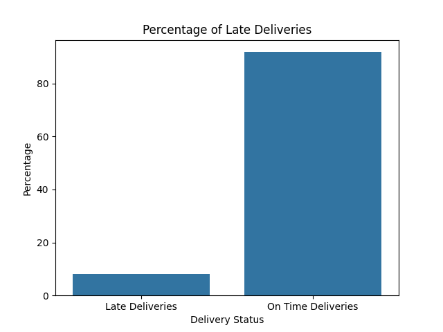
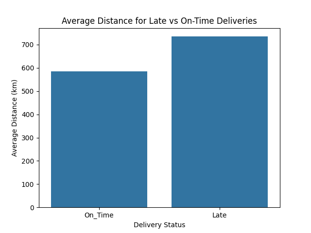
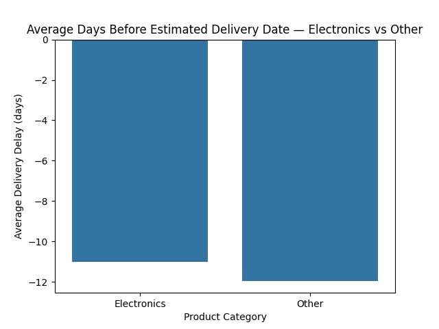
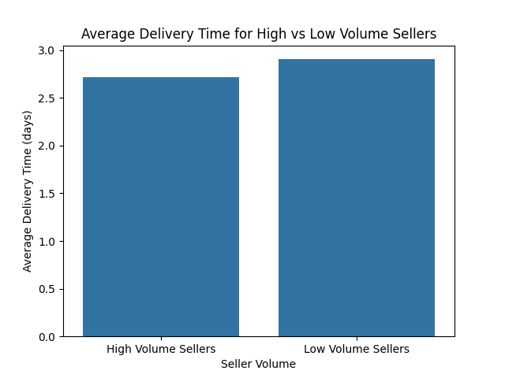

# Olist Delivery Analysis

## Headline

### Olist Delivers Orders 11 Days Ahead of Estimated Dates — Yet Late Deliveries Run 3.11% Above Industry Benchmark

---

## Business Context

Olist is a Brazilian e-commerce technology ecosystem that empowers small and medium-sized businesses (SMBs) by integrating marketplace sales, logistics, and financial services into a single platform. Late deliveries damage seller reputation, reduce customer trust, and directly impact marketplace retention and revenue growth.

---

## Approach

The analysis began by establishing a baseline — calculating the percentage of delivered orders that arrived after their estimated delivery date. Three operational hypotheses were tested across seven joined tables using SQL. Order, seller, customer, product, and geolocation datasets were combined to analyze delivery delays, dispatch efficiency, category performance, and delivery distance impact. The Haversine formula was applied to estimate geographical delivery distance between sellers and customers.

---

## Findings

**Finding 1:** 7,826 out of 96,478 delivered orders arrived late, resulting in an 8.11% late delivery rate — 3.11% above the industry benchmark.

**Finding 2:** Late delivery orders traveled an average distance of 735 km, which is 150 km more than on-time delivery orders.

**Finding 3:** Electronics products were delivered 11.01 days before the estimated delivery date, while other categories were delivered 11.94 days before estimated dates.

**Finding 4:** Sellers with more than 36 orders dispatched products within 2.7 days, while sellers with fewer than 36 orders dispatched within 2.9 days.

---

## Recommendations

### Recommendation 1 — Remove Estimated Delivery Date Padding (based on Finding 3)

Olist's operational team should reduce the 11-day delivery estimate buffer. The current padding hides operational inefficiencies and delays visibility into real delivery performance. Reducing the estimate gap would expose delivery bottlenecks earlier and allow targeted intervention.

### Recommendation 2 — Prioritize Dispatch for Long-Distance Orders (based on Finding 2)

Orders exceeding 735 km should be prioritized for dispatch within 24 hours of order confirmation. Long-distance deliveries represent the highest late-delivery risk segment and require operational prioritization.

### Recommendation 3 — Improve Dispatch Time for Low-Volume Sellers (based on Finding 4)

Low-volume sellers dispatch products slower than high-volume sellers. Olist should provide operational guidelines and fulfillment training to sellers with fewer than 36 orders to reduce dispatch delays.

---

## Visualizations

### Late Delivery Rate


### Distance Comparison — Late vs On-Time Orders


### Electronics vs Other Categories Delivery Performance


### Seller Dispatch Time Comparison


---

## Technical Proof

### Query 1 — Baseline Late Delivery Rate

```sql
Select late_delivery, total_delivery, 
(late_delivery/total_delivery) * 100 as percentage 
From (
    Select 
        Sum(Case when order_delivered_customer_date > order_estimated_delivery_date 
            Then 1 Else 0 End) as late_delivery, 
        Count(order_id) as total_delivery 
    from olist_orders_dataset 
    where order_status='delivered'
) as summary;
```

**Output:** 8.11% late delivery rate — 7,826 late orders out of 96,478 delivered.

---

### Query 2 — Average Distance: Late vs On-Time Orders

```sql
With c as (
    Select cu.customer_id, cu.customer_zip_code_prefix, g.Avg_lat, g.Avg_lng 
    From olist_customer_dataset cu
    Left Join geo_less g on cu.customer_zip_code_prefix = g.geolocation_zip_code_prefix
),
s as (
    Select se.seller_id, se.seller_zip_code_prefix, g.Avg_lat, g.Avg_lng 
    From olist_sellers_dataset se
    Left Join geo_less g on se.seller_zip_code_prefix = g.geolocation_zip_code_prefix
),
i as (
    Select it.order_id, it.seller_id, 
        c.Avg_lat as customer_lat, c.Avg_lng as customer_lng,
        s.Avg_lat as seller_lat, s.Avg_lng as seller_lng 
    From olist_orders_dataset o 
    Join olist_customer_dataset cu on o.customer_id = cu.customer_id 
    Join olist_order_items_dataset it on o.order_id = it.order_id 
    Join olist_sellers_dataset se on se.seller_id = it.seller_id
    Join c on cu.customer_id = c.customer_id
    Join s on se.seller_id = s.seller_id
)
Select delivery_flag, Avg(distance) as avg_distance
From (
    Select 
        6371 * ACOS(
            COS(RADIANS(i.seller_lat)) * COS(RADIANS(i.customer_lat)) *
            COS(RADIANS(i.seller_lng) - RADIANS(i.customer_lng)) +
            SIN(RADIANS(i.seller_lat)) * SIN(RADIANS(i.customer_lat))
        ) as distance,
        Case when order_delivered_customer_date > order_estimated_delivery_date 
            Then 'Late' Else 'On_Time' End as delivery_flag
    From i 
    Join olist_orders_dataset ol on i.order_id = ol.order_id
    Where ol.order_status = 'delivered'
) as dis
Group by delivery_flag;
```

**Output:** Late orders averaged 735 km. On-time orders averaged 585 km. Difference: 150 km.

---

### Query 3 — Average Delivery Days: Electronics vs Other Categories

```sql
Select 
    Avg(Case When TRIM(REPLACE(sub.product_category_name_english, '\r', '')) = 'electronics' 
        Then DATEDIFF(order_delivered_customer_date, order_estimated_delivery_date) 
        Else Null End) as Avg_elec_del,
    Avg(Case When TRIM(REPLACE(sub.product_category_name_english, '\r', '')) != 'electronics' 
        Then DATEDIFF(order_delivered_customer_date, order_estimated_delivery_date) 
        Else Null End) as Avg_del 
From (
    Select Distinct o.order_id, n.product_category_name_english, 
        o.order_delivered_customer_date, o.order_estimated_delivery_date
    From olist_order_items_dataset i 
    Join olist_orders_dataset o on i.order_id = o.order_id
    Join olist_products_dataset p on i.product_id = p.product_id
    Join product_category_name_translation n on p.product_category_name = n.product_category_name
    Where o.order_status = 'delivered'
) sub;
```

**Output:** Electronics delivered 11.01 days before estimated date. Other categories delivered 11.94 days before estimated date. Difference: 0.9 days.

---

### Query 4 — Seller Dispatch Time: High vs Low Volume

```sql
With c as (
    Select i.seller_id, o.order_id, 
        o.order_delivered_carrier_date, o.order_approved_at
    From olist_orders_dataset o 
    Join olist_order_items_dataset i on o.order_id = i.order_id
),
s as (
    Select seller_id, Count(order_id) as order_by_seller 
    From c 
    Group by seller_id
)
Select 
    Avg(Case When order_by_seller > 36 
        Then DATEDIFF(c.order_delivered_carrier_date, c.order_approved_at) 
        Else Null End) as Avg_high_vol_days,
    Avg(Case When order_by_seller <= 36 
        Then DATEDIFF(c.order_delivered_carrier_date, c.order_approved_at) 
        Else Null End) as Avg_low_vol_days
From c 
Left Join s on c.seller_id = s.seller_id;
```

**Output:** High-volume sellers dispatch in 2.7 days. Low-volume sellers dispatch in 2.9 days.

---

## Tools & Technologies

- MySQL
- Python
- Pandas
- Matplotlib
- Jupyter Notebook
- SQL Window Functions
- Common Table Expressions (CTEs)
- Haversine Formula
- GitHub

---

## Dataset

Dataset: [Olist Brazilian E-Commerce Dataset](https://www.kaggle.com/datasets/olistbr/brazilian-ecommerce)
